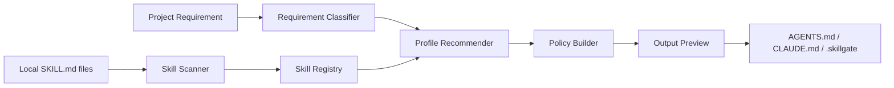

<div align="center">
  <a href="./README.md">中文</a>
  <br>
  <br>
  

  <h1>SkillGate 🧭</h1>

  <hr>

  <p><strong>A project-level Skill Policy workspace for Codex, Claude Code, and local coding-agent workflows.</strong></p>

  <p>
    SkillGate scans real local Skills, understands project requirements, recommends activation boundaries,
    and generates project-level policy files that agents can read and follow.
    It makes “what should run, what needs manual intent, and what should stay disabled” explicit and reusable.
  </p>

  <p>
    
    
    
    
    
    
    
  </p>

  <p><strong>[Hero Demo Image: show the Skill Registry, Policy Builder, and Output Preview workflow here]</strong></p>
</div>

<br>

## Overview 🧭

SkillGate is a local Skill policy manager that defines clear capability boundaries for coding agents on a per-project basis. It is built for developers who already use Codex, Claude Code, plugin Skills, or multiple local automation capabilities.

It does not try to help you install more Skills. It helps you decide which Skills a specific project should actually use. By scanning real `SKILL.md` files, analyzing project requirements, recommending activation states, and generating policy files, SkillGate turns scattered capability choices into reviewable project context.

> Tip  
> If you only want to run the project quickly, go straight to “Quick Start”. The recommended path is `npm.cmd run dev`, which starts both the frontend and the local API.

<br>

## Why this exists 💡

As the number of Skills grows, project context can become noisy. A small change may accidentally trigger design review, browser testing, document processing, image generation, or deployment flows; different projects also need different capability sets that global configuration cannot express well.

SkillGate is designed to answer three questions before work begins:

- Which Skills should be enabled by default for this project?
- Which Skills are useful but should only run with explicit intent?
- Which Skills are unrelated or risky enough to stay disabled by default?

The current version uses a **Soft Policy** model: SkillGate does not directly modify the internal scheduling logic of Codex or Claude Code. Instead, it generates human-readable and machine-reusable project policy files that help agents follow clearer capability boundaries inside the current repository.

<br>

## Key Features ✨

- **Real local Skill scanning**: Recursively finds `SKILL.md` files on the machine and inside the project, then shows only Skills with verified source paths.
- **Requirement analysis**: Classifies the project type, capability needs, and recommendation rationale from plain requirement text.
- **Three-state activation policy**: Marks Skills as `enabled`, `manual_only`, or `disabled`, which is more practical than a simple on/off switch.
- **Conflict detection and responsibility mapping**: Identifies potential overlap across design, browser testing, documents, deployment, and similar capabilities.
- **Policy preview and confirmed write**: Shows generated files and overwrite risk before writing `AGENTS.md`, `CLAUDE.md`, and `.skillgate` files.
- **Local API backend**: Uses Express for real filesystem scanning, recommendation, preview, and write operations; the frontend verifies the scanner version.

<br>

## Demo / Screenshots 📸

This repository already includes a README logo, but real product screenshots have not been committed yet. Recommended assets:

| Placement | Description |
| --- | --- |
| Hero Demo | Show the full product path across Dashboard, Skill Registry, Policy Builder, and Output Preview. |
| Main Screenshot | Show local Skill scan results, scanned root status, and `scannerVersion`. |
| Output Screenshot | Show the preview for `AGENTS.md`, `CLAUDE.md`, and `.skillgate/profile.json` before writing. |

```text
[Hero Demo Image: show the main SkillGate workflow here]
```

See [README_IMAGE_GUIDE.md](./README_IMAGE_GUIDE.md) for the full asset checklist.

<br>

## How it works ⚙️

SkillGate follows a simple chain: scan real capabilities, understand the project requirement, generate a policy, and write project files.



Default scan locations include:

```text
%USERPROFILE%\.codex\skills
%USERPROFILE%\.agents\skills
%USERPROFILE%\.claude\skills
%USERPROFILE%\.codex\plugins\cache
project\.codex\skills
project\.agents\skills
%APPDATA%\Codex\skills
```

The backend returns `scannerVersion: local-skill-scan-v3`. The frontend uses that value to confirm it is connected to the current local-only scanner, avoiding stale backends or sample data.

<br>

## Quick Start 🚀

### Requirements

- Node.js 20 or later
- npm
- Windows, macOS, or Linux

### Install

```powershell
npm.cmd install
```

### Run

```powershell
npm.cmd run dev
```

This starts:

- Vite frontend dev server: `http://localhost:3000`
- Express local API: `http://localhost:8787` by default

If `8787` is already in use, the backend automatically tries `8788`, `8789`, and `8790`. The frontend probes those ports as well.

### Verify

```powershell
npm.cmd run lint
npm.cmd run build
```

<br>

## Usage 🛠️

### 1. Scan local Skills

After starting the app, open **Skill Registry** and run a scan. A successful scan should show real local Skills, source paths, scanned root status, and a line similar to:

```text
Scanner: local-skill-scan-v3
```

### 2. Generate a project Profile

Open **Project Setup**, enter the target project path and a requirement such as:

```text
I want to build an ecommerce frontend with product listings, search, cart, checkout, and mobile support.
```

SkillGate generates a recommended profile from the requirement and scanned Skills, including enabled, manual-only, and disabled suggestions.

### 3. Preview and write policy files

Adjust the strategy in **Policy Builder**, then inspect generated files in **Output Preview**. After confirmation, SkillGate can write:

```text
AGENTS.md
CLAUDE.md
.skillgate/profile.json
.skillgate/skill-policy.md
.skillgate/session-prompt.md
```

<br>

## Configuration 🧰

| Variable | Default | Required | Purpose |
| --- | --- | --- | --- |
| `SKILLGATE_API_PORT` | `8787` | No | Sets the starting local API port; fallback ports are tried if it is occupied. |
| `VITE_SKILLGATE_API_URL` | Empty | No | Sets the frontend API URL; empty value enables local port probing. |
| `CODEX_HOME` | System default | No | Adds Codex Skills and plugin cache directories to the scan. |
| `CLAUDE_HOME` | System default | No | Adds the Claude Skill directory to the scan. |
| `AGENTS_HOME` | System default | No | Adds the agents Skill directory to the scan. |
| `APPDATA` | System environment | No | Used on Windows to scan `%APPDATA%\Codex\skills`. |

See [.env.example](./.env.example) for an example.

<br>

## Architecture 🧩

SkillGate uses a local full-stack structure: React powers the workspace UI, Express handles filesystem access and policy operations, and shared TypeScript modules hold the core recommendation logic.

```text
SkillGate
├─ React + Vite frontend
│  ├─ Dashboard
│  ├─ Project Setup
│  ├─ Skill Registry
│  ├─ Policy Builder
│  ├─ Output Preview
│  └─ Settings
│
├─ Express local API
│  ├─ GET  /api/health
│  ├─ POST /api/skills/scan
│  ├─ POST /api/profile/recommend
│  └─ POST /api/policy/*
│
├─ Core logic
│  ├─ classifyRequirement
│  ├─ resolveSkills
│  ├─ detectConflicts
│  └─ generatePolicy
│
└─ Policy outputs
   ├─ AGENTS.md
   ├─ CLAUDE.md
   └─ .skillgate/*
```

Key directories:

| Path | Purpose |
| --- | --- |
| `src/pages` | Dashboard, Project Setup, Skill Registry, and related screens. |
| `src/core` | Requirement classification, Skill resolution, conflict detection, and policy generation. |
| `src/api/client.ts` | API probing, request helpers, and stale backend protection. |
| `server/services` | Local scanning, profile recommendation, and policy file writing services. |
| `scripts/dev.mjs` | Development script that starts both frontend and backend. |

<br>

## Roadmap 🗺️

- More precise Skill classification and risk modeling
- Profile import, export, and multi-project management
- Skill change diffing
- Richer conflict-rule editing
- More specific policy templates for Codex and Claude Code
- Optional CLI version
- Broader cross-platform path scanning

<br>

## FAQ ❓

### Why is the scan result empty?

Most often, the machine has no installed Skills containing `SKILL.md`, or the Skills are outside scanned directories. The browser may also still be connected to an older backend. Start with:

```powershell
npm.cmd run dev
```

Then refresh the page and scan again.

### Is `.claude\skills` showing missing an error?

No. SkillGate scans several common candidate directories and reports missing paths as diagnostics. If another directory contains `SKILL.md`, the app can still work normally.

### Does SkillGate directly change Codex or Claude Code configuration?

No. The current version only generates project-level policy files and writes them to the target project after user confirmation.

### What if port 8787 is already in use?

The backend automatically tries `8788`, `8789`, and `8790`. The frontend also checks `/api/health` and `scannerVersion` to avoid connecting to a stale backend.

<br>

## Contributing 🤝

Issues and PRs are welcome. A minimal contribution flow:

1. Describe the problem, use case, or Skill category you want to support.
2. Run `npm.cmd run lint` and `npm.cmd run build` for code changes.
3. If you change scanning, recommendation, or write behavior, include a short behavior note or screenshot.

Please keep PRs focused. Avoid mixing documentation rewrites, UI redesigns, and core logic changes in one patch.

<br>

## License 📄

This repository has not declared an open-source license yet: `[License]`.

Until an explicit License file is added, do not assume the project can be freely redistributed or reused.

<br>

## Contact 📬

- Maintainer: `[Maintainer]`
- Website: `[Website]`
- Docs: `[Docs]`
- Community: `[Community]`

