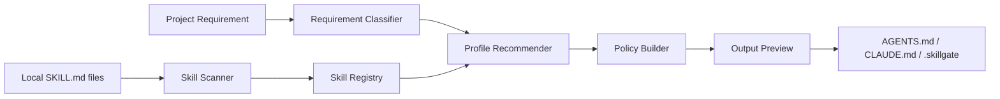

<div align="center">
  <a href="./README.en.md">English</a>
  <br>
  <br>
  

  <h1>SkillGate 🧭</h1>

  <hr>

  <p><strong>面向 Codex、Claude Code 与本地 coding-agent 工作流的项目级 Skill Policy 工作台。</strong></p>

  <p>
    SkillGate 扫描本机真实存在的 Skill，理解项目需求，推荐启用边界，并生成可落地的项目级策略文件。
    它让“该启用什么能力、何时手动触发、哪些能力应默认禁用”变得清晰、可审查、可复用。
  </p>

  <p>
    
    
    
    
    
    
    
  </p>

  <p><strong>[Hero Demo Image: show the Skill Registry, Policy Builder, and Output Preview workflow here]</strong></p>
</div>

<br>

## 项目概览 🧭

SkillGate 是一个本地运行的 Skill 策略管理器，用于为每个项目划定 coding agent 的能力边界。它面向已经在使用 Codex、Claude Code、插件 Skill 或多种本地自动化能力的开发者。

它不解决“安装更多 Skill”的问题，而是解决“一个项目到底应该启用哪些 Skill”的问题。通过扫描真实 `SKILL.md`、分析项目需求、推荐启用策略和生成策略文件，SkillGate 把分散的能力选择变成可审查的项目上下文。

> Tip  
> 如果你只想最快运行项目，请直接查看“快速开始”。当前推荐使用 `npm.cmd run dev` 同时启动前端与本地 API。

<br>

## 为什么做这个 💡

Skill 越多，项目上下文越容易变得嘈杂。一个简单改动可能误触发设计审查、浏览器测试、文档处理、图片生成或部署流程；不同项目真正需要的能力组合也很难靠全局配置表达。

SkillGate 的目标是让项目开始前就回答三个问题：

- 当前项目应默认启用哪些 Skill？
- 哪些 Skill 有价值，但只应在明确需要时手动触发？
- 哪些 Skill 与当前项目不相关，或风险较高，应默认禁用？

当前版本采用 **Soft Policy** 模式：SkillGate 不直接修改 Codex 或 Claude Code 的底层调度逻辑，而是生成人可读、机器可复用的项目级策略文件，让 agent 在当前仓库中遵守更明确的能力边界。

<br>

## 核心功能 ✨

- **真实本机 Skill 扫描**：递归查找本机和项目目录中的 `SKILL.md`，只展示真实存在且带来源路径的 Skill。
- **项目需求分析**：根据需求文本识别项目类型、能力需求和推荐理由，避免从技术名词开始硬匹配。
- **三段式启用策略**：将 Skill 标记为 `enabled`、`manual_only` 或 `disabled`，比简单开关更贴近真实工作流。
- **冲突检测与职责拆分**：识别设计、浏览器测试、文档、部署等能力之间的潜在重叠，并写入项目策略。
- **Policy 预览与确认写入**：在写入 `AGENTS.md`、`CLAUDE.md` 和 `.skillgate` 文件前展示预览和覆盖风险。
- **本地 API 后端**：使用 Express 执行真实文件系统扫描、推荐、预览和写入，前端会校验后端扫描器版本。

<br>

## 效果展示 📸

当前仓库已包含 README logo，但尚未提交真实产品截图。建议补充以下素材：

| 位置 | 说明 |
| --- | --- |
| Hero Demo | 展示 Dashboard、Skill Registry、Policy Builder 和 Output Preview 的完整产品路径。 |
| 主界面截图 | 展示本机 Skill 扫描结果、扫描根目录状态和 `scannerVersion`。 |
| 输出结果截图 | 展示写入前的 `AGENTS.md`、`CLAUDE.md` 与 `.skillgate/profile.json` 预览。 |

```text
[Hero Demo Image: show the main SkillGate workflow here]
```

更具体的素材清单见 [README_IMAGE_GUIDE.md](./README_IMAGE_GUIDE.md)。

<br>

## 工作原理 ⚙️

SkillGate 的核心链路是“扫描真实能力 → 理解项目需求 → 生成策略 → 写入项目文件”。



默认扫描位置包括：

```text
%USERPROFILE%\.codex\skills
%USERPROFILE%\.agents\skills
%USERPROFILE%\.claude\skills
%USERPROFILE%\.codex\plugins\cache
项目目录\.codex\skills
项目目录\.agents\skills
%APPDATA%\Codex\skills
```

后端返回 `scannerVersion: local-skill-scan-v3`，前端会用它确认当前连接的是新版 local-only 扫描器，避免误连旧后端或展示示例数据。

<br>

## 快速开始 🚀

### 环境要求

- Node.js 20 或更高版本
- npm
- Windows、macOS 或 Linux

### 安装

```powershell
npm.cmd install
```

### 启动

```powershell
npm.cmd run dev
```

这条命令会同时启动：

- Vite 前端开发服务：`http://localhost:3000`
- Express 本地 API：默认 `http://localhost:8787`

如果 `8787` 被占用，后端会自动尝试 `8788`、`8789`、`8790`，前端也会自动探测这些端口。

### 验证

```powershell
npm.cmd run lint
npm.cmd run build
```

<br>

## 使用方式 🛠️

### 1. 扫描本机 Skill

启动应用后进入 **Skill Registry**，点击扫描按钮。成功时应能看到本机真实 Skill 列表、来源路径、扫描根目录状态，以及类似信息：

```text
Scanner: local-skill-scan-v3
```

### 2. 生成项目 Profile

进入 **Project Setup**，输入目标项目路径和需求描述，例如：

```text
我要做一个电商前端页面，需要商品列表、搜索、购物车、结算流程和移动端适配。
```

SkillGate 会根据需求和扫描到的 Skill 生成推荐 profile，并给出启用、手动触发和禁用建议。

### 3. 预览并写入策略文件

进入 **Policy Builder** 调整策略后，在 **Output Preview** 中检查待写入文件。确认后可写入目标项目：

```text
AGENTS.md
CLAUDE.md
.skillgate/profile.json
.skillgate/skill-policy.md
.skillgate/session-prompt.md
```

<br>

## 配置说明 🧰

| 配置项 | 默认值 | 是否必填 | 作用 |
| --- | --- | --- | --- |
| `SKILLGATE_API_PORT` | `8787` | 否 | 指定本地 API 起始端口；被占用时会继续尝试后续端口。 |
| `VITE_SKILLGATE_API_URL` | 空 | 否 | 指定前端请求的 API 地址；为空时前端会自动探测本地端口。 |
| `CODEX_HOME` | 系统默认路径 | 否 | 追加扫描 Codex Skill 与插件缓存目录。 |
| `CLAUDE_HOME` | 系统默认路径 | 否 | 追加扫描 Claude Skill 目录。 |
| `AGENTS_HOME` | 系统默认路径 | 否 | 追加扫描 agents Skill 目录。 |
| `APPDATA` | 系统环境变量 | 否 | Windows 下用于扫描 `%APPDATA%\Codex\skills`。 |

示例配置见 [.env.example](./.env.example)。

<br>

## 技术架构 🧩

SkillGate 使用本地一体化的前后端结构：React 负责工作台界面，Express 负责文件系统访问和策略生成，核心推荐逻辑位于共享 TypeScript 模块中。

```text
SkillGate
├─ React + Vite 前端
│  ├─ Dashboard
│  ├─ Project Setup
│  ├─ Skill Registry
│  ├─ Policy Builder
│  ├─ Output Preview
│  └─ Settings
│
├─ Express 本地 API
│  ├─ GET  /api/health
│  ├─ POST /api/skills/scan
│  ├─ POST /api/profile/recommend
│  └─ POST /api/policy/*
│
├─ Core 业务逻辑
│  ├─ classifyRequirement
│  ├─ resolveSkills
│  ├─ detectConflicts
│  └─ generatePolicy
│
└─ Policy 输出
   ├─ AGENTS.md
   ├─ CLAUDE.md
   └─ .skillgate/*
```

关键目录：

| 路径 | 说明 |
| --- | --- |
| `src/pages` | Dashboard、Project Setup、Skill Registry 等页面。 |
| `src/core` | 需求分类、Skill 解析、冲突检测和 Policy 生成逻辑。 |
| `src/api/client.ts` | 前端 API 探测、请求封装和旧后端拦截。 |
| `server/services` | 本机扫描、profile 推荐和策略文件写入服务。 |
| `scripts/dev.mjs` | 一键启动前端和后端的开发脚本。 |

<br>

## 路线图 🗺️

- 更精细的 Skill 分类规则和风险模型
- Profile 导入、导出与多项目管理
- Skill 变更差异对比
- 更丰富的冲突规则编辑器
- 针对 Codex / Claude Code 的策略模板细分
- 可选命令行版本
- 更完整的跨平台路径扫描策略

<br>

## 常见问题 ❓

### 为什么扫描结果是 0？

通常是因为本机没有安装包含 `SKILL.md` 的 Skill，或 Skill 位于未扫描目录。也可能是浏览器仍连接旧后端。建议使用：

```powershell
npm.cmd run dev
```

然后刷新页面并重新扫描。

### `.claude\skills` 显示 missing 是错误吗？

不是。SkillGate 会扫描多个常见候选目录，某些目录不存在时会作为诊断信息展示。只要其他目录能扫描到 `SKILL.md`，就不影响使用。

### 会直接修改 Codex 或 Claude Code 的配置吗？

不会。当前版本只生成项目级策略文件，并在用户确认后写入目标项目目录。

### 端口 8787 被占用怎么办？

后端会自动尝试 `8788`、`8789`、`8790`。前端也会验证 `/api/health` 和 `scannerVersion`，尽量避免连接旧后端。

<br>

## 贡献指南 🤝

欢迎通过 issue 或 PR 参与改进。建议的最小流程：

1. 先描述问题、场景或希望支持的 Skill 类型。
2. 对代码改动运行 `npm.cmd run lint` 和 `npm.cmd run build`。
3. 如果修改扫描、推荐或写入逻辑，请补充对应的行为说明或截图。

提交 PR 时请保持变更聚焦，避免把文档重写、UI 重构和核心逻辑改动混在一起。

<br>

## 许可证 📄

当前仓库尚未声明开源许可证：`[License]`。

在补充明确 License 文件前，请不要默认假设该项目可自由分发或二次开发。

<br>

## 维护者信息 📬

- Maintainer: `[Maintainer]`
- Website: `[Website]`
- Docs: `[Docs]`
- Community: `[Community]`

